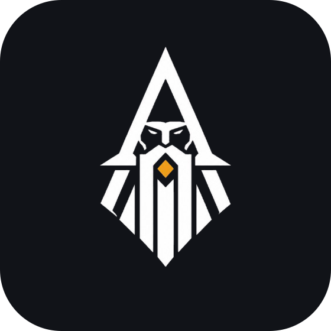
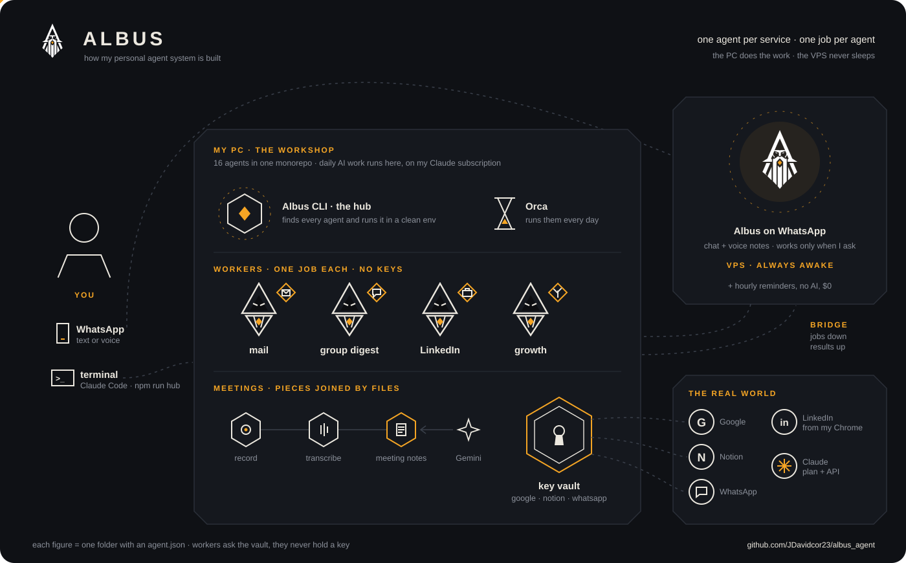

  <!--
    Two variants on purpose: the logo is a white stroke on transparent, so on
    GitHub's LIGHT theme it would be invisible.
  -->
  <picture>
    <source media="(prefers-color-scheme: dark)" srcset="docs/logo.png">
    
  </picture>

<h1 align="center">Albus</h1>

  <strong>My personal agent system.</strong> 
  A CLI that runs a small team of AI agents for my day-to-day: email, WhatsApp,
  Notion, Google, meetings, job search. I talk to it from the terminal or from
  WhatsApp.

> **Heads up:** this is a portfolio piece, not a product. It's wired to my
> accounts and my routines. It's here to show how I design automation, not for
> you to install.

---

## The architecture

  

**Two front doors.** On the PC I ask Claude Code in this repo, or run an agent
myself with `npm run hub`. Away from the PC I write (or send a voice note) to
Albus on WhatsApp.

**The PC does the work.** Every agent is one folder in a single monorepo
(`agents-hub`) with an `agent.json` that says what it does and how to run it.
The hub finds them, runs them with a clean environment and collects their
results. Orca runs the daily ones on schedule and the report lands on my
WhatsApp.

**The VPS is always on.** Albus lives there on [Hermes](https://github.com/NousResearch/hermes-agent):
it chats, transcribes my voice notes and answers with voice. When something
needs my PC (my Chrome, my home IP, my Claude subscription), it drops a job in a
queue. The PC picks it up and runs it only if it's on an allowlist.

## The agents

| Kind | Agents | Job |
|---|---|---|
| **Providers** | `google`, `notion`, `whatsapp` | The only ones holding credentials. Everyone else calls them. |
| **Workers** | `mail-triage`, `whatsapp-digest`, `outreach`, `growth` | Read my mail, summarize groups, answer LinkedIn, turn feedback into a plan |
| **Meetings** | `obs-capture` → `transcriber` → `meeting-router` ← `gemini-notes` | Recording to transcript to one set of notes, filed where it belongs |
| **Plumbing** | `hermes-vps`, `bridge`, `orca-reporter`, `claude-relay` | Deploy to the VPS, PC ⇄ VPS jobs, push results and alerts to WhatsApp |

## The ideas behind it

- **One agent per service, one job per agent.** A Google agent, a Notion agent,
  a WhatsApp agent. Small pieces that snap together like Lego, joined by files
  and a tiny JSON contract, never one giant script.
- **A secret never leaves its provider.** Workers ask `google` to do the call;
  they never see the token. Google tokens are split by scope, so the agent that
  *reads* my mail physically *can't send* any.
- **Brakes are code, not prompts.** My personal WhatsApp is read-only because
  the sending code doesn't exist, not because a setting says so. Nothing gets
  sent or submitted without my OK.
- **Pay where it makes sense.** Daily AI work runs on the PC with my Claude
  subscription. The VPS uses the paid API only when I ask it something. Its
  scheduled jobs use no AI at all, so they cost $0.

## Stack

TypeScript · Node · Claude Code · Hermes on a Linux VPS · Baileys (WhatsApp) ·
Google and Notion APIs · whisper · Orca for scheduling · Ink for the setup TUI.
